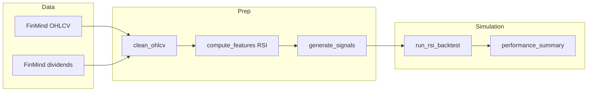

# Strategy and code structure

This document describes what **stock-strat** does today: the **trading strategy**, how **data flows** through the code, and how the **repository is organized**.

## What this project does

**stock-strat** is an **educational** Python pipeline for **backtesting** a simple **long-only** rule on **Taiwan listed stocks** (TWSE codes via [FinMind](https://github.com/FinMind/FinMind) `TaiwanStockPrice`). You choose a symbol (e.g. **2317** 鴻海, **2330** 台積電), a date range, and the simulator reports **performance metrics**, optional **daily cash/equity**, and helpers for **walk-forward** and **stress** checks.

It does **not** place live orders or connect to a broker API.

---

## Strategy (current behavior)

### Idea

A **mean-reversion style** rule using **RSI (Wilder, 14 periods)** on **dividend-adjusted daily closes**:

- **Enter long** when RSI **crosses into** “oversold”: first bar where RSI **&lt; 30** after it was **not** below 30 on the previous bar.
- **Exit long** when RSI **crosses into** “above exit zone”: first bar where RSI **&gt; 50** after it was **not** above 50 on the previous bar.

Constants live in [`src/stock_strat/config.py`](../src/stock_strat/config.py): `RSI_PERIOD`, `RSI_ENTRY` (30), `RSI_EXIT` (50).

### Execution model (important)

| Step | Meaning |
|------|--------|
| **Signal** | Computed from the **close** of day *t* (RSI uses adjusted close). |
| **Fill** | Orders execute at the **next** day’s **open** (*t+1*). |

So the backtest does **not** assume you buy at the same close that generated the signal.

### Position sizing

- **Long only** (no shorting).
- On entry: invest a **fraction of available cash** (`equity_fraction`, default **1.0**) after buy-side commission at the **open** price.
- On exit: sell **all shares** at the **open**; proceeds net of sell-side commission and **證交稅** (see below).

### Costs (two modes)

| Mode | When | What is charged |
|------|------|------------------|
| **Taiwan-style** (default on `stock-strat run`) | `--legacy-fee` **omitted** | **Commission** on buy (cash) and sell (gross), plus **sell tax** on sell gross only (default **0.3%** for normal 現股). Defaults approximate **2 折** on the **0.1425%** statutory cap per side. |
| **Legacy single rate** | `--legacy-fee FRAC` | One fraction applied to **buy cash** and **sell gross** (no separate sell tax). Used by `walkforward` / `stress` **fee** sweeps and many research commands. |

**Optional minimum commission** per brokerage leg (`--min-commission`, default **0** in CLI) can approximate a typical retail floor (e.g. **1 TWD**). **Slippage** scales effective buy/sell opens. **Gap / range skips** (`--skip-gap-pct`, `--skip-range-pct`) optionally withhold fills for analysis. Confirm **real** rates with your broker (e.g. [永豐 手續費](https://www.sinotrade.com.tw/newweb/Fee_Rate)).

### Data for the strategy

- **OHLCV** from FinMind, cached under `data/cache/` as Parquet.
- **Cash dividends** applied as **backward adjustment** to OHLC (see [`src/stock_strat/clean.py`](../src/stock_strat/clean.py)) so RSI and returns are not distorted by ex-div jumps.

---

## Code structure

### Layout (high level)

```text
stock-strat/
  pyproject.toml
  README.md
  docs/
    STRATEGY_AND_STRUCTURE.md   # this file
  data/                         # cached Parquet + sidecar JSON metadata
    cache/
  notebooks/
  src/
    stock_strat/
      __init__.py
      __main__.py               # python -m stock_strat
      config.py                 # symbols, defaults, Taiwan fee constants
      pipeline.py               # load → clean → features → signals
      data/
        finmind.py              # FinMind TaiwanStockPrice + dividends
        yahoo.py                # optional Yahoo cross-check
      clean.py                  # dividend adjustment
      features.py               # RSI (Wilder)
      strategy.py               # signal_entry_cross / signal_exit_cross
      backtest.py               # run_rsi_backtest, portfolio_daily_table
      metrics.py                # performance_summary, trade_stats
      walkforward.py            # OOS windows + wf-optimize
      stress.py                 # fee grid + subperiods
      grid_search.py            # RSI grid + stability summary
      universe.py               # ticker list + liquidity + batch metrics
      portfolio.py              # top-N rotation + equal-weight curve combine
      benchmarks.py             # buy-hold, MA trend, fantasy same-close
      stats_validation.py       # bootstrap Sharpe, Bonferroni, permutation p-value
      events.py                 # ex-dividend window splits
      cli.py                    # stock-strat CLI
  tests/
```

### Data flow



### Module responsibilities

| Module | Role |
|--------|------|
| [`config.py`](../src/stock_strat/config.py) | TWSE/Yahoo symbols, date defaults, RSI thresholds, Taiwan-style default commission/sell tax, paths. |
| [`data/finmind.py`](../src/stock_strat/data/finmind.py) | `fetch_ohlcv_twse`, `load_or_fetch_ohlcv`, `fetch_dividends_twse`; Parquet cache. |
| [`data/yahoo.py`](../src/stock_strat/data/yahoo.py) | Optional `yfinance` OHLCV for sanity checks. |
| [`clean.py`](../src/stock_strat/clean.py) | `clean_ohlcv`: backward cash-dividend adjustment by `stock_id`. |
| [`features.py`](../src/stock_strat/features.py) | `rsi_wilder`, `compute_features` (RSI, optional stock SMA/vol), `merge_index_regime` for index ETF/index series. |
| [`strategy.py`](../src/stock_strat/strategy.py) | `generate_signals` → `signal_entry_cross`, `signal_exit_cross`; optional stock SMA, vol percentile, and index-above-SMA gates on entries. |
| [`backtest.py`](../src/stock_strat/backtest.py) | `run_rsi_backtest` (slippage, min commission, partial deploy, optional gap/range skip); `portfolio_daily_table`. |
| [`metrics.py`](../src/stock_strat/metrics.py) | Total return, CAGR, vol, max drawdown, Sharpe, etc. |
| [`walkforward.py`](../src/stock_strat/walkforward.py) | `run_walk_forward` (fixed signals); `walk_forward_optimize` (grid on train, frozen params on test). |
| [`stress.py`](../src/stock_strat/stress.py) | Fee sensitivity grid + named subperiods. |
| [`grid_search.py`](../src/stock_strat/grid_search.py) | `run_grid_on_clean`, `stability_summary`. |
| [`universe.py`](../src/stock_strat/universe.py) | `run_universe`, `liquidity_filter`, ticker list loader. |
| [`portfolio.py`](../src/stock_strat/portfolio.py) | `simulate_top_n_entry_rotation`, `equal_weight_combine_equity`. |
| [`benchmarks.py`](../src/stock_strat/benchmarks.py) | Buy-hold, MA trend, fantasy same-close ablation. |
| [`stats_validation.py`](../src/stock_strat/stats_validation.py) | Bootstrap Sharpe CI, Bonferroni alpha, permutation p-value. |
| [`events.py`](../src/stock_strat/events.py) | Ex-dividend window metric splits (`ex_dividend_experiment`). |
| [`pipeline.py`](../src/stock_strat/pipeline.py) | `load_clean_ohlcv`, `build_strategy_frame`: load → features → signals. |
| [`cli.py`](../src/stock_strat/cli.py) | Subcommands below. |

### CLI (`stock-strat`)

| Command | Purpose |
|---------|---------|
| `run` | Full-sample backtest; JSON includes **`buy_and_hold`** (same dates, invest at first open / hold to last close, no fees) and **`excess_*_vs_buy_hold`** vs the strategy; plus RSI params, regime flags, execution extras, Taiwan vs `--legacy-fee`. |
| `grid` | Full RSI `default_grid()` on cached OHLCV + `stability` summary; optional `--use-taiwan-fees`. |
| `wf-optimize` | `walk_forward_optimize` — grid on train, OOS test with frozen params. |
| `run-universe` | Ticker file + liquidity filters + per-symbol metrics table. |
| `portfolio-top-n` | Daily top-N among entry signals (lowest RSI), equal weight. |
| `portfolio-ew-combine` | Equal-weight combine of single-name equity curves (overlap dates). |
| `benchmarks` | Buy-hold, MA trend, RSI strategy, fantasy same-close. |
| `stats` | Bootstrap Sharpe, permutation p-value, Bonferroni note. |
| `events` | Ex-dividend window vs outside (`ex_dividend_experiment`). |
| `walkforward` | Out-of-sample window metrics; **legacy** `--fee`. |
| `stress` | Fee grid + subperiod report; **legacy** `--fee`. |

Install exposes the entry point via `pyproject.toml` (`[project.scripts]`).

### Engine note

The backtest is **pandas/numpy** only (no vectorbt / numba), so it runs on current Python versions without a numba dependency.

---

## Related files

- Quick setup and commands: [README.md](../README.md)
- Example notebook: [notebooks/01_2317_rsi.ipynb](../notebooks/01_2317_rsi.ipynb)
